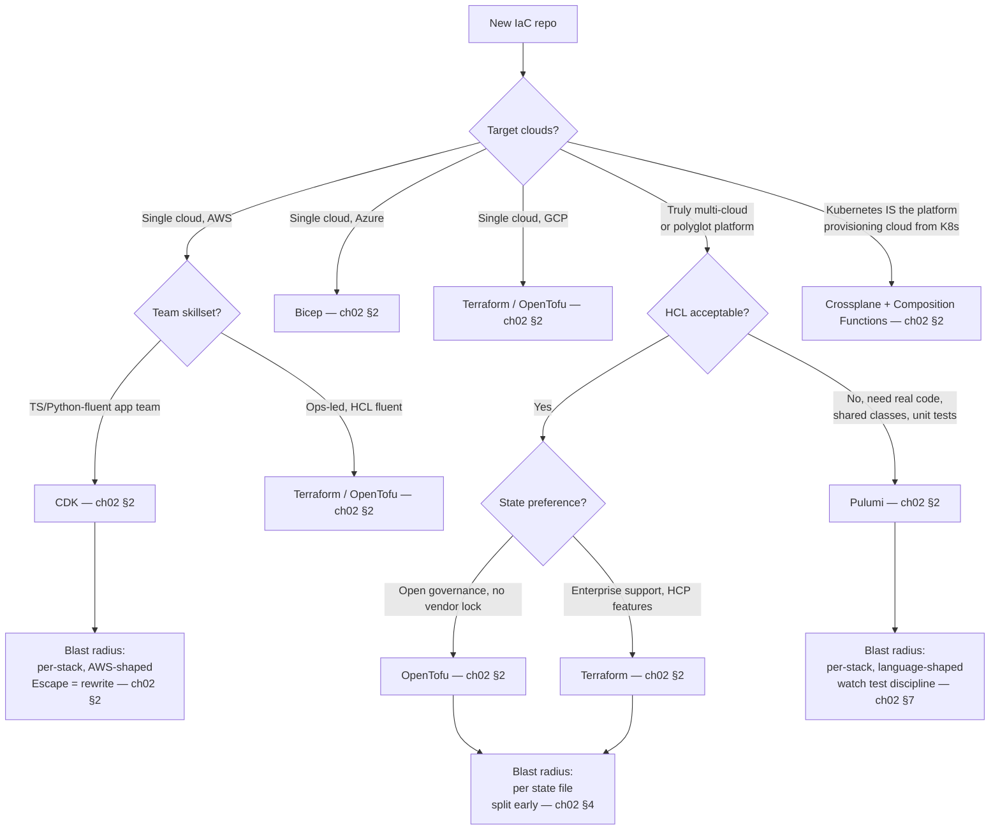
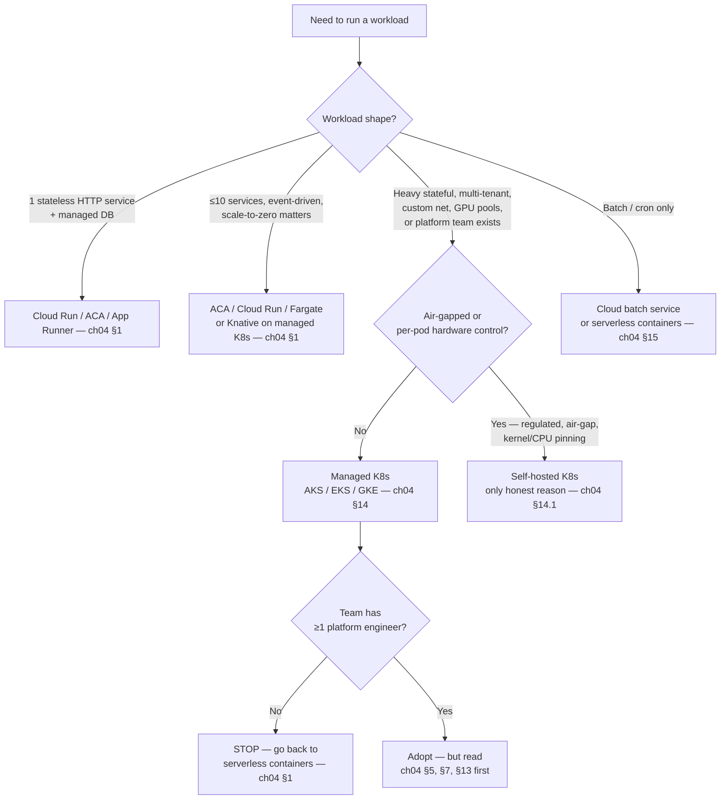
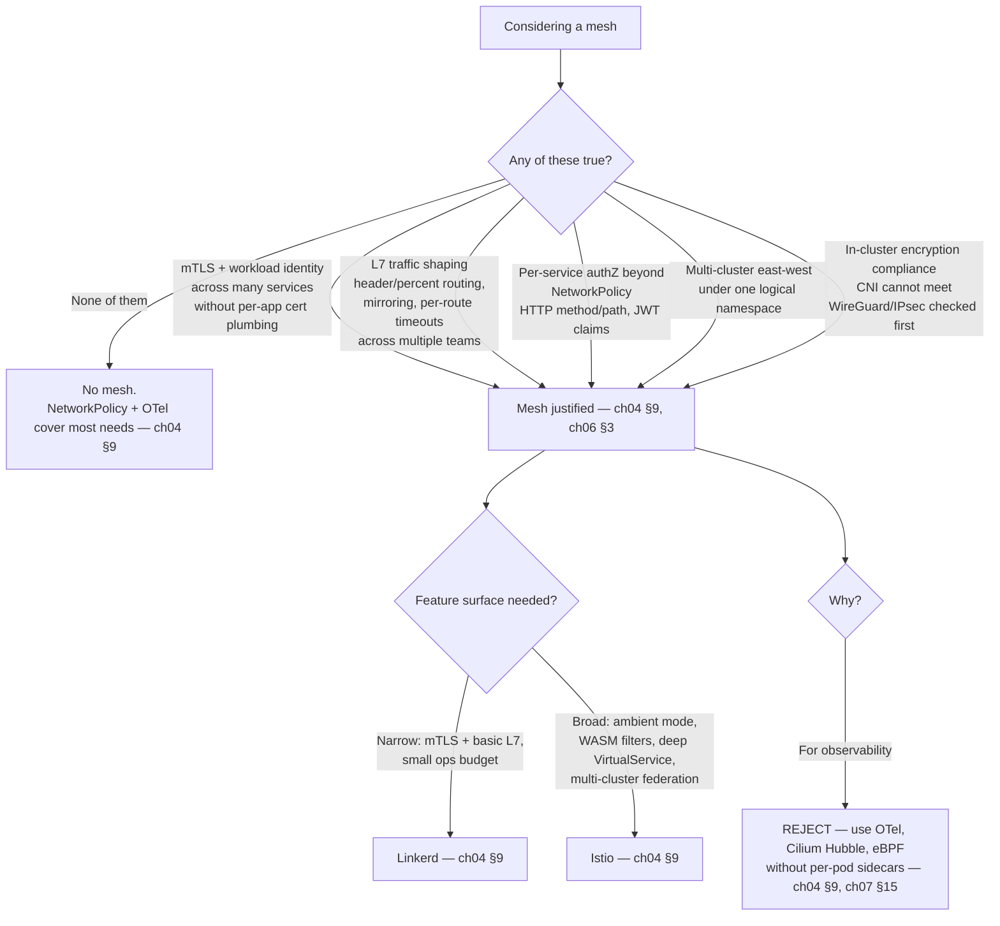
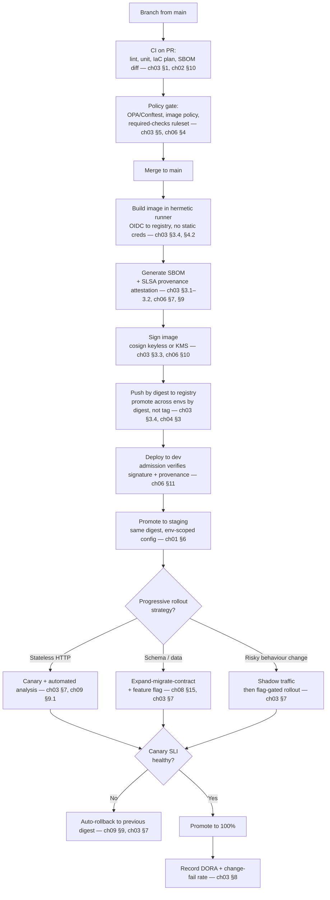
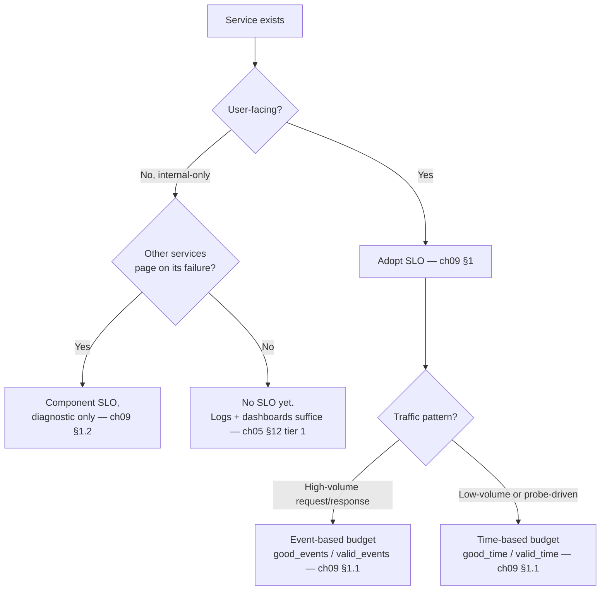
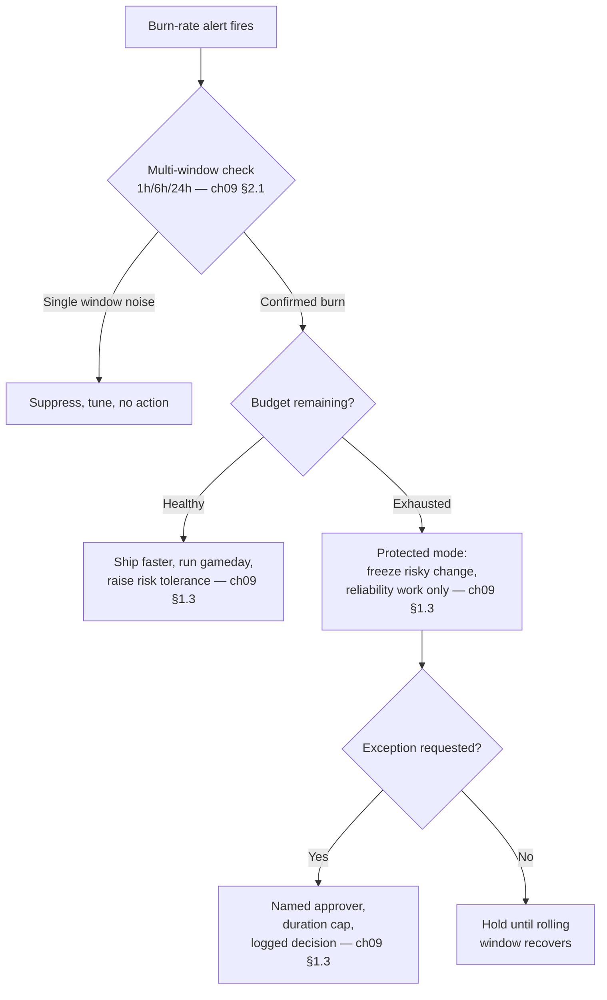
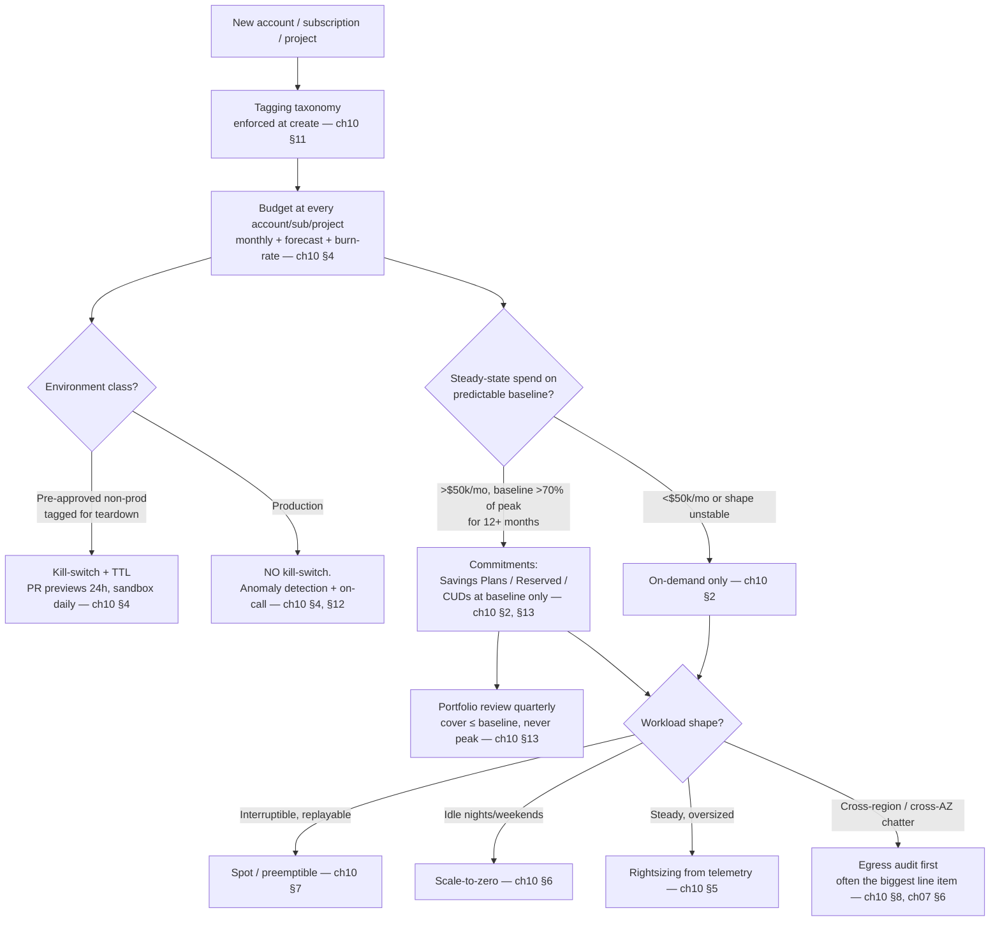

# Decision Trees — One-Hour Synthesis

This page is the "if you only have one hour with the guide, read this" index.
It compresses the eleven chapters into the decisions whose cost of reversal
is highest, then gives a tree per recurring scenario. Every node cites the
chapter where the rationale lives — go there before you argue with the tree.

---

## 1. The 12 highest-leverage decisions

Ranked by cost-of-reversal, not novelty. If you get any of these wrong, you
will pay for it for years; if you get the bottom of the list wrong, you pay
for it for a quarter.

- **1. Account / subscription / project topology and region set.**
  Defines blast radius, IAM boundary, billing boundary, and data-residency
  posture. Renaming is a migration, not an edit. — `ch01 §6`, `ch07 §1`,
  `ch10 §11`.
- **2. IP address plan (global CIDR + per-VPC /16s).**
  Overlapping CIDRs cannot be peered, VPN'd, or transit-gateway'd; the only
  fix is renumbering production. — `ch07 §2`.
- **3. Identity model (workload identity + human SSO).**
  "No static credentials" is the foundation everything else assumes; if you
  ship long-lived keys, every later control is a workaround. — `ch06 §3`,
  `ch03 §4.2`.
- **4. IaC tool per repo + state model.**
  One tool per state file. Mixing CDK and raw CFN, or Terraform and
  OpenTofu, against the same state produces undiffable drift. — `ch02 §2`,
  `ch02 §4`.
- **5. Deployment unit + registry + signing model.**
  OCI image is the universal unit; the registry/signing/digest-pin chain is
  the supply-chain backbone. Changing it later means re-signing history. —
  `ch03 §3`, `ch04 §3`, `ch06 §10–11`.
- **6. Secrets store and rotation policy.**
  Choosing the wrong store (or none) leaks into every pipeline, manifest,
  and runbook. — `ch02 §8`, `ch06 §2`.
- **7. Observability backbone (OTel + collector + storage tier).**
  Instrumentation lives in every service forever. SDK/protocol churn is the
  most expensive refactor in the guide. — `ch05 §2–3`, `ch05 §7`.
- **8. SLO + error-budget policy (signed, not aspirational).**
  Without it, "reliability vs velocity" is decided by whoever shouts
  loudest, per incident. — `ch09 §1`.
- **9. Data tier: managed vs self-hosted, RPO/RTO tier.**
  Stateful choices outlive three generations of compute. — `ch08 §1`,
  `ch08 §4`.
- **10. Kubernetes yes/no, and if yes — managed vs self-hosted.**
  Wrong "yes" buys a permanent platform-tax; wrong self-host buys a
  permanent on-call tax. — `ch04 §1`, `ch04 §14`.
- **11. CI/CD topology: push vs pull, monorepo vs polyrepo, runner trust.**
  Defines who can deploy what, and the trust boundary of every action. —
  `ch03 §1–2`, `ch03 §6`, `ch03 §9`.
- **12. Tagging / labelling / cost-allocation taxonomy.**
  Retro-tagging six months of resources is the FinOps equivalent of
  renumbering a VPC. — `ch10 §11`.

Everything else in the guide is recoverable in a quarter. These twelve are
not.

---

## 2. Decision: which IaC tool?

Compress of `ch02 §2`. Pick **one tool per repo, one CLI per state file**.
Multi-cloud tooling is justified by a multi-cloud *operation*, not a
multi-cloud *aspiration* (`ch02 §2`, "Should").



Anti-choices to call out in review (`ch02 §2`):

- **CDK "in case we leave AWS one day"** — CDK synthesizes CloudFormation;
  output is AWS-shaped down to IAM. Leaving = rewrite.
- **Pulumi because you dislike HCL** — HCL fluency is a one-week
  investment; Pulumi's payoff is shared classes and tests, not syntax.
- **Ansible for cloud resources** — Ansible is for OS-level config on
  long-lived hosts. Use it for that, only.

---

## 3. Decision: should we adopt Kubernetes?

Default is **no** until you can name three workloads that need it
(`ch04 §1`). Kubernetes is a platform for building platforms; the
operational tax (control plane upgrades, CNI/CSI churn, RBAC, capacity
planning) usually exceeds the benefit for a single team running fewer than
~30 services.



Smell test from `ch04 §1`: if `kubectl get pods -A` fits on one screen
*and* you have no platform engineer, you are paying the K8s tax for
nothing.

---

## 4. Decision: service mesh? Which?

The default is **no mesh**. A mesh adds sidecar lifecycles, certificate
rotation, control-plane upgrades, and an extra hop to debug, on every
workload, forever (`ch04 §9`). Adopt only when at least one concrete
trigger fires.



Cross-ref `ch07 §15`: mesh is the L7 layer; do not let it eat L3/L4
networking decisions that belong in the VPC and CNI.

---

## 5. Decision: build a platform team / IDP?

`ch11 §16` is explicit: charter on **criteria, not headcount**. Reframed as
a tree:

```mermaid
flowchart TD
    A[Pressure to "build a platform"] --> B{Repeated toil:<br/>≥3 stream-aligned teams<br/>suffer the same shared-infra pain?}
    B -->|No| Z1[Defer. Fix it in<br/>the loudest team first — ch11 §16]
    B -->|Yes| C{Demonstrated demand:<br/>those teams have signed up<br/>to adopt the first capability?}
    C -->|No| Z2[Defer. "If you build it<br/>they will come" is an anti-pattern — ch11 §13]
    C -->|Yes| D{Sustained funding:<br/>≥2 engineers + PM-equivalent<br/>for ≥1 year, not borrowed?}
    D -->|No| Z3[Defer. Part-time platform<br/>is worse than no platform — ch11 §16]
    D -->|Yes| E{Complexity worth amortising:<br/>abstraction saves more team-hours/qtr<br/>than it costs to maintain?}
    E -->|No| Z4[Defer. Document the pattern<br/>as a paved path instead — ch11 §4]
    E -->|Yes| F[Charter the team.<br/>Write the memo first — ch11 §16]

    F --> G{Need an IDP UI?}
    G -->|Golden paths fit in<br/>a CLI + repo template| H[Skip Backstage<br/>start with templates — ch11 §9]
    G -->|>5 capabilities,<br/>>3 audiences, discovery problem real| I[Adopt IDP — ch11 §5, §9]
```

Engineer-count thresholds (`~30 engineers / ~10 services`) are signals,
not gates (`ch11 §16`). Some compliance-heavy 20-engineer orgs need a
platform on day one; some 200-engineer orgs with uniform workloads never
do.

---

## 6. Decision: multi-region / multi-cloud?

These are two different decisions, conflated constantly. Decide them
separately.

### 6a. Multi-region

```mermaid
flowchart TD
    A[Single-region today] --> B{What is the<br/>customer-facing RTO?}
    B -->|< 5 min| C{Data tier supports<br/>sync standby or<br/>distributed-SQL quorum?}
    B -->|< 1 h| D[Multi-AZ HA<br/>+ cross-region async replica — ch08 §4 tier 1]
    B -->|< 4 h| E[Multi-AZ HA<br/>+ cross-region snapshot — ch08 §4 tier 2]
    B -->|< 24 h| F[Single region<br/>+ daily backup — ch08 §4 tier 3]

    C -->|Yes| G[Active/active multi-region — ch08 §4 tier 0<br/>ch09 §12]
    C -->|No| H[STOP. Either change tier,<br/>or change engine — ch08 §1, §4]

    D --> I{Tested in a<br/>quarterly game-day?}
    E --> I
    G --> I
    I -->|No| J[Your RTO is "unknown" — ch08 §3]
    I -->|Yes| K[Coherent posture]
```

Most workloads are tier 1 or 2 (`ch08 §4`). Pretending you're tier 0 is
the most common and most expensive mistake in the chapter.

### 6b. Multi-cloud

```mermaid
flowchart TD
    A[Pressure to go multi-cloud] --> B{Driver?}
    B -->|"Avoid lock-in"| Z1[REJECT. Abstraction tax is real;<br/>most "multi-cloud" orgs are<br/>"primary + a few SaaS" — ch02 §2]
    B -->|Regulatory: sovereign cloud<br/>required in jurisdiction X| C[Run jurisdiction X<br/>in the required cloud only.<br/>Rest stays primary — ch07 §1, ch08 §14]
    B -->|Customer contract requires it| D[Scope to that customer.<br/>Do not generalise — ch10 §15]
    B -->|Cost arbitrage| Z2[REJECT. Egress + re-platforming<br/>usually exceed savings — ch10 §15]
    B -->|Acquisition / merger| E[Federate identity + billing first<br/>migrate workloads on demand<br/>ch01 §6, ch06 §3]
    B -->|Genuine HA beyond region failure| F{Has a region-level outage<br/>actually broken your SLO?}
    F -->|No| Z3[REJECT. Multi-region first — §6a]
    F -->|Yes, repeatedly| G[Active/active across clouds<br/>only data tier with native<br/>cross-cloud replication — ch08 §1, ch09 §12]
```

`ch10 §15` is blunt: "move to a cheaper cloud" is a trap. The cost of
moving usually exceeds three years of the savings.

---

## 7. Decision: how to ship a change safely?

The canonical pipeline. Each arrow is a contract; if any link is missing
or unsigned, the chain breaks (`ch03 §3`, `ch06 §9–11`).



Two contracts that are non-negotiable:

- **Promote by digest, never by tag.** Tags are mutable; digests are not
  (`ch03 §3.4`, `ch04 §3`).
- **Admission verifies signature *and* provenance.** A signed image with no
  provenance only proves "someone signed it", not "your pipeline built it"
  (`ch06 §11`).

---

## 8. Decision: SLO model and error budgets

`ch09 §1` is the spine. Adopt SLOs as soon as you have a user-facing
service on a paid pager rotation. Before that, you are guessing.

### 8a. When to adopt



### 8b. How strict

- Pick targets from **user expectations and the dependency floor**, not
  from "more nines is better" (`ch09 §1`). 100% is the wrong target.
- One window per org. **30 days is the default**; 28d for sprint
  alignment; quarterly for batch (`ch09 §1`).
- 2–3 SLIs per critical user journey, drawn from the menu in `ch09 §1.2`.
  Component SLOs are diagnostic, not paging contracts.

### 8c. What to do when burned

The error-budget policy is a **signed contract** before you ever exceed it
(`ch09 §1.3`). Minimum clauses:



Anti-pattern (`ch09 §13`): SLOs nobody enforces. If breach has no
consequence, it is a vanity metric.

---

## 9. Decision: cost guardrails

`ch10` orders this clearly: visibility, then commitment, then
optimisation. Skipping levels is the most common FinOps mistake.



Two rules `ch10` is loud about:

- **Forecast and burn-rate alerts must fire days before the 100% line.**
  By the time the month closes, the money is spent (`ch10 §4`).
- **Commitments cover baseline, never peak.** Unused commitment is a
  guaranteed loss, not a hedge (`ch10 §2.2`).

---

## 10. Common scenarios → chapter map

Read in the listed order. Stop when the immediate problem is solved.

| Scenario | Read in this order |
| --- | --- |
| Greenfield in cloud X, single team, web service | `ch01 §6,7` (envs, tooling) → `ch07 §1–3` (network primitives, IP plan) → `ch06 §2–3` (secrets, workload identity) → `ch03 §1,3,4` (pipeline + supply chain + OIDC) → `ch04 §1` (probably *not* K8s) → `ch05 §2,4,12` (OTel + tier-1 obs) → `ch10 §4,11` (budgets + tagging) |
| Brownfield monolith, want CI/CD | `ch03 §1,5,6` (pipeline-as-code, branch protection, mono vs poly) → `ch06 §2–3,10` (secrets, identity, signing) → `ch03 §3` (SLSA/SBOM minimum bar) → `ch08 §15` (schema migrations as deploys) → `ch03 §7` (progressive delivery) → `ch09 §1` (SLO before you add risk) |
| Platform team of 4 supporting 80 devs | `ch11 §1–4` (what platform is, as a product, golden paths) → `ch11 §10–12` (Team Topologies, Conway, cognitive load) → `ch11 §6,8` (surface, abstraction level) → `ch04 §13` (multi-tenancy) → `ch02 §3,13` (modules, repo topology) → `ch11 §14` (metrics) |
| Migrating from CloudFormation to Terraform / OpenTofu | `ch02 §2` (is the migration justified?) → `ch02 §4,4a` (state model + migration) → `ch02 §13` (repo topology) → `ch02 §9,9a` (provider lock + provenance) → `ch02 §10` (plan-review discipline) → `ch03 §3.4` (artifact promotion semantics still apply) |
| Adding a second region | `ch08 §4` (RTO/RPO tier first) → `ch08 §5` (HA topologies) → `ch07 §1,5,8` (network, DNS, LB) → `ch09 §12` (DR mechanics) → `ch10 §8` (egress cost reality) → `ch05 §7` (federated long-term storage) |
| Considering Kubernetes | `ch04 §1` (do you?) → `ch04 §14` (managed vs self-hosted) → `ch04 §5,6,7` (requests, probes, security) → `ch04 §8,10` (NetworkPolicy, Gateway API) → `ch04 §13` (multi-tenancy) → `ch04 §9` (mesh — usually no) |
| Considering a service mesh | `ch04 §9` (triggers + default no) → `ch07 §15` (cross-ref, L3/L4 vs L7) → `ch06 §3` (workload identity overlap) → `ch05 §3` (mesh telemetry vs OTel) |
| Building an IDP / Backstage | `ch11 §16` (readiness gate first) → `ch11 §4,5` (golden paths, IDP) → `ch11 §9` (when *not* to adopt Backstage) → `ch11 §6,7,8` (surface, principles, abstraction) → `ch11 §17` (docs as product) |
| First on-call rotation | `ch09 §1` (SLO) → `ch09 §2` (multi-window burn-rate) → `ch09 §3` (incident response roles) → `ch09 §5` (runbooks as code) → `ch09 §6` (rotation models, page budget) → `ch09 §4` (blameless postmortem) |
| Cost is suddenly out of control | `ch10 §3` (visibility before optimisation) → `ch10 §12` (anomaly detection) → `ch10 §8` (egress audit) → `ch10 §5,6,7` (rightsize, scale-to-zero, spot) → `ch10 §4` (budgets + burn-rate) → `ch10 §13` (commitments only after baseline is clear) |
| Supply-chain incident in the news | `ch06 §18` (lessons) → `ch06 §6` (package ingestion controls) → `ch03 §4.1,4.5` (pinned actions, xz lesson) → `ch06 §7,9,10,11` (SBOM, SLSA, sign, verify) → `ch06 §17` (shift left *and* everywhere) |
| Data tier choice (new service) | `ch08 §1` (managed vs self-hosted) → `ch08 §4` (RPO/RTO tier) → `ch08 §5` (HA topology) → `ch08 §10,15` (schema evolution + migration as deploy) → `ch08 §2,3` (backups, restore drills) → `ch08 §16` (encryption) |

---

## Closing rule

Every tree above picks a side. Disagree by reading the cited chapter and
finding a different rule there — not by adding a branch. This page is
synthesis, not a menu.
